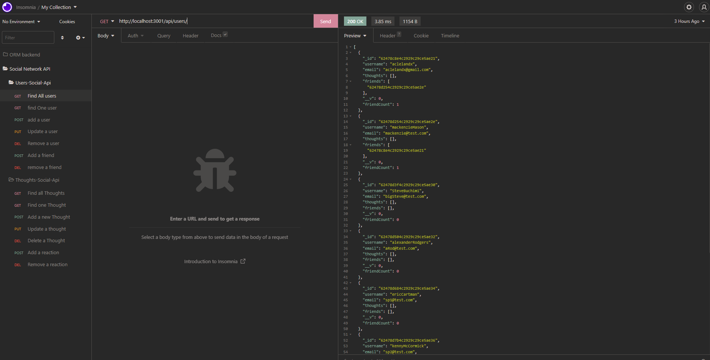
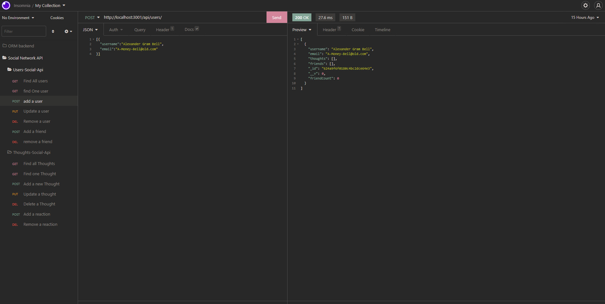
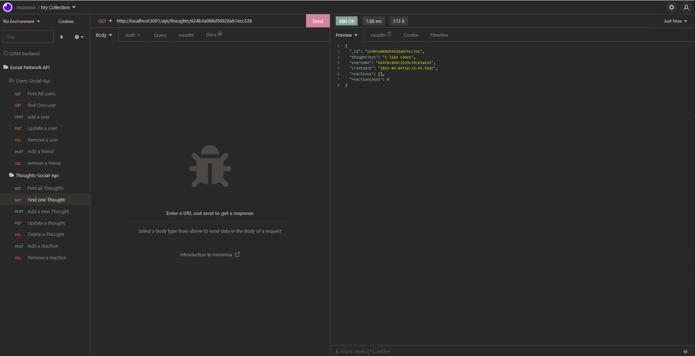

# Social-Network-Api-NoSQL-Adam-Cleland

We are tasked with creating a social network API that utilizes NoSQL type database. In this application the DB system that we are using in mongo, this allows us to store and save information on a database and interact with it instead of using a SQL based DB. This application an assignment for The Ohio State Full Stack Boot Camp.

## Table of contents

---

- **Installation Instructions**
- **Usage Information**
- **Tests**
- **Screenshots**
- **Contributions**
- **Questions**
- **License**

## Installation

---

clone the repo and run on your local device using npm start to being the server. (make sure to have mongo running at this time.)

## Usage Information

---

while mongo is running, enter the command npm start to have the application being, You may use a querying program like insomnia to my api request to the api.

All routes in the api being with /api

## WalkThrough Video

---

Here is a link to a walk through video for the functionality of this application.

[Click me!](https://drive.google.com/file/d/1B0aTmZ2aYZSMVyejoHoPwmB3rwZxR2ud/view)

## ScreenShots

---

## Contributions

---

Pull requests are welcome. For major changes, please open an issue first to discuss what you would like to change.

## Questions

---

### For Any Questions about the Application feel free to reach out to me on:

Github: [aclelandx](https://github.com/aclelandx)

Email: <aClelandx@gmail.com>

## License

---

Copyright [2022] [Adam Cleland]

        Permission is hereby granted, free of charge, to any person obtaining a copy of this software and associated documentation files (the "Software"), to deal in the Software without restriction, including without limitation the rights to use, copy, modify, merge, publish, distribute, sublicense, and/or sell copies of the Software, and to permit persons to whom the Software is furnished to do so, subject to the following conditions:

        The above copyright notice and this permission notice shall be included in all copies or substantial portions of the Software.

        THE SOFTWARE IS PROVIDED "AS IS", WITHOUT WARRANTY OF ANY KIND, EXPRESS OR IMPLIED, INCLUDING BUT NOT LIMITED TO THE WARRANTIES OF MERCHANTABILITY, FITNESS FOR A PARTICULAR PURPOSE AND NONINFRINGEMENT. IN NO EVENT SHALL THE AUTHORS OR COPYRIGHT HOLDERS BE LIABLE FOR ANY CLAIM, DAMAGES OR OTHER LIABILITY, WHETHER IN AN ACTION OF CONTRACT, TORT OR OTHERWISE, ARISING FROM, OUT OF OR IN CONNECTION WITH THE SOFTWARE OR THE USE OR OTHER DEALINGS IN THE SOFTWARE.

v
